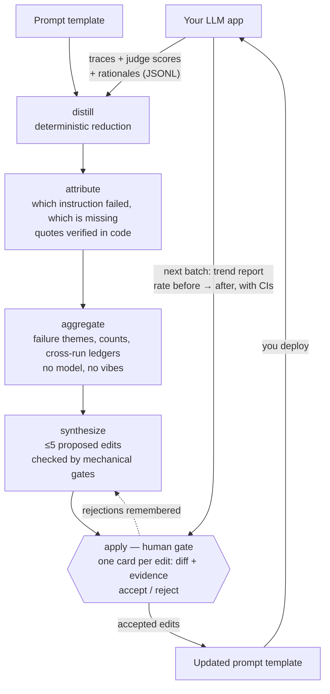

# tracegrad

**Evidence-gated system-prompt optimization from the traces you already have.**

Your LLM app runs. A judge scores each response. The traces pile up — and nothing
reads them. When the prompt gets edited, it's because someone remembered a failure
and guessed at a fix.

tracegrad closes that loop. Feed it a batch of traces with judge results, and it
proposes a small set of edits to your prompt template — each one backed by verbatim
quotes from real traces, capped at five per run, and gated by you. It never writes
without your approval.

> **Status: pre-release.** The design spec is complete and reviewed; implementation
> is in progress. See the [implementation plan](../../issues/1). The interface
> described below is the target, not yet the shipping tool.

## Why

- **Prompt edits are guesses.** tracegrad replaces "I think the tone instruction
  is the problem" with "this instruction was violated in 19% of traces — here are
  the quotes."
- **Prompts only grow.** Every instruction you add costs tokens on every request,
  forever, and dilutes the rest. tracegrad works under a token budget: at the
  ceiling, every addition must name the removal that pays for it.
- **One weird trace shouldn't rewrite your prompt.** A new instruction needs the
  same failure in at least two independent sessions or runs, tracked across
  batches in a ledger.
- **You stay in charge.** Analysis never writes. `tracegrad apply` shows each edit
  with its evidence; you accept or reject. Rejections are remembered.

## How it works



Every quote is substring-verified in code against the stored trace — a model
cannot confabulate evidence past the gate. On the next batch, tracegrad shows you
how each accepted edit's failure theme moved, with confidence intervals, so you
know whether it worked before you trust it.

## What you need

- Your traces exported as JSONL: `{trace_id, input, output, judge: {score,
  rationale}, prompt_hash}` per line. One small export script from whatever eval
  stack you use — tracegrad never learns your stack.
- A judge that writes a **rationale**, not just a score. The rationale is the
  signal.
- A model to run the analysis. Two options, mixable per stage:
  - any OpenAI-compatible API (OpenRouter by default) with one env-var key, or
  - a coding-agent harness you're already logged into (`claude` supported
    out of the box; others are a config entry).

## Usage (target interface)

```sh
uv tool install tracegrad

cd my-app-evals
tracegrad init
tracegrad run --traces batch.jsonl --manifest manifest.json --estimate  # cost preview
tracegrad run --traces batch.jsonl --manifest manifest.json             # analyze, propose
tracegrad apply                                                         # review, accept/reject
tracegrad status                                                        # budget, trends, ledgers
```

## What tracegrad is not

- Not an autonomous loop. Cross-batch trends are advisory — statistics with error
  bars for you to read, never an automatic revert. (An opt-in A/B mode for
  trustworthy automatic verdicts is on the roadmap.)
- Not an eval harness. It doesn't run your app or host your judge.
- Not magic attribution. It optimizes against your judge; if your judge is wrong,
  tracegrad is confidently wrong with it. Freeze and version your judge.

## How it compares

Most prompt optimizers are **search loops**: they need to re-run your app (or a
callable of it) hundreds of times to score candidate prompts. If all you have is
a folder of traces from production, they cannot help you. tracegrad is built for
exactly that case: static traces in, evidenced edit proposals out, zero re-runs
required.

| | tracegrad | DSPy / GEPA / MIPROv2 | TextGrad | ProTeGi | promptfoo | Langfuse / LangSmith | backpass |
|---|---|---|---|---|---|---|---|
| What it is | Offline prompt optimizer | Search-based prompt optimizers | Gradient-style text optimizer | Beam-search prompt editor | Eval harness | Observability + eval platform | Agent-memory optimizer |
| Needs to run your app | **No — static traces only** | Yes, many rollouts | Yes | Yes | Yes (it runs the evals) | No | No (reads transcripts) |
| Input | JSONL traces + judge scores | A program + metric callable | Differentiable pipeline | Task + eval set | Configs + test cases | Instrumented app | Session transcripts |
| Output | ≤5 evidenced edits to your prompt | A rewritten prompt/program | Updated prompt | Updated prompt | Scores and diffs | Dashboards, datasets | Edits to AGENTS.md/CLAUDE.md |
| Evidence per change | Verbatim quotes, substring-verified in code | Aggregate score only | Aggregate score only | Aggregate score only | n/a | n/a | Verbatim quotes |
| Human approval gate | **Every edit** | No | No | No | n/a | n/a | Every edit |
| Token-budget discipline | Yes — additions must pay for themselves | No | No | No | n/a | n/a | Yes |
| Tracks whether an edit worked | Next-batch trend report with CIs | Score during search | Score during search | Score during search | Yes (re-run evals) | Yes (dashboards) | Informal |
| Harness / stack coupling | None — bring JSONL | DSPy programs | PyTorch-style graphs | Own loop | Its own runner | SDK instrumentation | Claude Code sessions |

Two honest notes: if you *can* re-run your app cheaply against a metric,
GEPA-style search will explore far more of the prompt space than tracegrad ever
will — use it. And observability platforms are complementary, not competing:
they're a fine place to *export* the traces tracegrad consumes.

## Prior art

The discipline layer — evidence gating, ledgers, edit caps, budget, human gate —
is adapted from [backpass](https://github.com/kunchenguid/backpass), which does
this for agent memory files. tracegrad applies it where an explicit judge signal
exists, and swaps transcript archaeology for measurable loss.

## License

MIT
