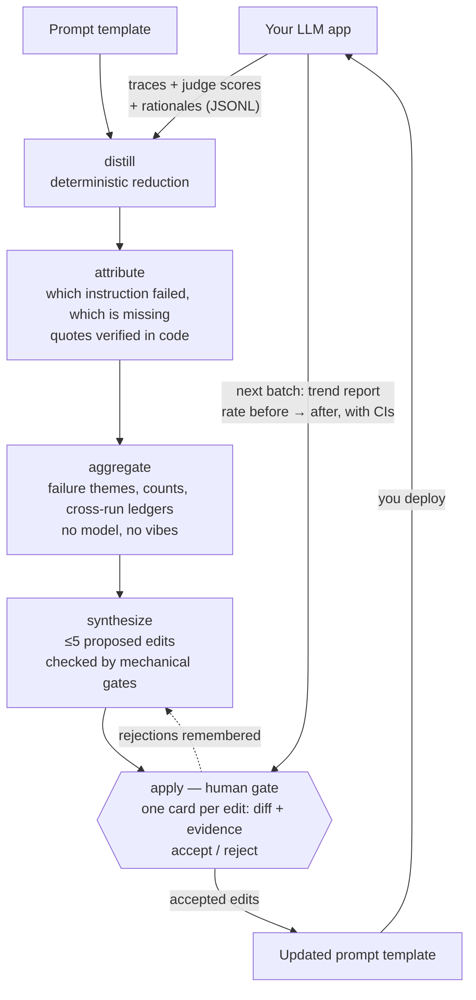

# tracegrad

**Evidence-gated system-prompt optimization from the traces you already have.**

Your LLM app runs. A judge scores each response. The traces pile up — and nothing
reads them. When the prompt gets edited, it's because someone remembered a failure
and guessed at a fix.

tracegrad closes that loop. Feed it a batch of traces with judge results, and it
proposes a small set of edits to your prompt template — each one backed by verbatim
quotes from real traces, capped at five per run, and gated by you. It never writes
without your approval.

> **Status: v0.1.0, not published to PyPI.** Install from source until it is.
> The pipeline below runs end to end against the batch in [`example/`](example/).
> See the [implementation plan](../../issues/1) for what is deferred past v0.1.0
> (A/B mode, replay hook, the `jinja-basic` template engine).

## Why

- **Prompt edits are guesses.** tracegrad replaces "I think the tone instruction
  is the problem" with "this instruction was violated in 19% of traces — here are
  the quotes."
- **Prompts only grow.** Every instruction you add costs tokens on every request,
  forever, and dilutes the rest. tracegrad works under a token budget: at the
  ceiling, every addition must name the removal that pays for it.
- **One weird trace shouldn't rewrite your prompt.** A new instruction needs the
  same failure in at least two independent sessions or runs, tracked across
  batches in a ledger.
- **You stay in charge.** Analysis never writes. `tracegrad apply` shows each edit
  with its evidence; you accept or reject. Rejections are remembered.

## How it works



Every quote is substring-verified in code against the stored trace — a model
cannot confabulate evidence past the gate. On the next batch, tracegrad shows you
how each accepted edit's failure theme moved, with confidence intervals, so you
know whether it worked before you trust it.

Two batches are only compared when they were measured the same way. The model,
its sampling, and every version in the deterministic core are folded into an
instrument fingerprint that each report carries; if it changed, tracegrad says
the batches are not comparable rather than differencing them anyway.

## What you need

- Your traces exported as JSONL: `{trace_id, input, output, judge: {score,
  rationale}, prompt_hash}` per line. One small export script from whatever eval
  stack you use — tracegrad never learns your stack.
- A judge that writes a **rationale**, not just a score. The rationale is the
  signal.
- A model to run the analysis. Two options, mixable per stage:
  - any OpenAI-compatible API (OpenRouter by default) with one env-var key, or
  - a coding-agent harness you're already logged into (`claude` supported
    out of the box; others are a config entry).

## Usage

```sh
uv tool install git+https://github.com/dnth/tracegrad

cd my-app-evals
tracegrad init
tracegrad run --traces batch.jsonl --manifest manifest.json --estimate  # cost preview
tracegrad run --traces batch.jsonl --manifest manifest.json             # analyze, propose
tracegrad apply                                                         # review, accept/reject
tracegrad trends                                                        # last two runs
tracegrad status                                                        # budget, trends, ledgers
```

Core-only install has no Kitaru package, server, worker, or observability
integration. `run --traces`, `apply`, and `trends` work without it.
`tracegrad verify` without a backend prints an actionable message and exits
non-zero — a verify that exits 0 having done nothing would read as verified
in CI.

`run` prints one review card per proposed edit — the diff, the verbatim quotes
behind it, and any flags — and writes the proposal to `.tracegrad/`. Nothing
touches your prompt until `tracegrad apply`. `apply --revert` restores the
snapshot taken before the write.

Harness loop (Claude Code / Pi): [`skills/tracegrad-harness/`](skills/tracegrad-harness/).

Two more commands exist for staged use: `tracegrad attribute` runs the paid
attribution pass alone and caches it, and `tracegrad propose` then produces the
proposal for the cost of a single synthesis call. `tracegrad trends` compares
the last two runs.

Attribution is one model call per trace, so `run --jobs 8` is worth setting on
any batch above a handful of traces.

### Optional: Kitaru as a trace source and replay backend

Kitaru is an **optional extra**, pinned `kitaru>=0.22,<0.23`. The base package
has no Kitaru dependency; `import tracegrad` never requires it. The extra
installs a **client**. It does not install verification — replays run on a
worker in *your* agent virtualenv. tracegrad stores no Kitaru secrets; use
`kitaru login`.

```sh
uv tool install "tracegrad[kitaru]"
# from this repo until PyPI:
#   uv tool install "git+https://github.com/dnth/tracegrad[kitaru]"
kitaru login
```

`.tracegradrc` may hold only non-secret selection; flags override:

```toml
[kitaru]
cohort = "support-production"
evaluation = "quality"
```

`--source kitaru` is a fetch-and-map: it writes JSONL the existing pipeline
already reads, then ingest runs unchanged. `--traces` and `--source kitaru`
are mutually exclusive. `engine = "format"` manifests are refused with a
named error. Mapped traces and a source fingerprint are snapshotted under
`.tracegrad/sources/kitaru/` before ingest; re-runs read the snapshot;
`--refresh` refetches. The cohort version is resolved once per run.

```sh
tracegrad run \
  --source kitaru \
  --kitaru-cohort support-production \
  --kitaru-evaluation quality \
  --manifest manifest.json
```

`judge_fingerprint` is derived from the evaluator (`quality@3`). A conflicting
manifest value is an error. Set the manifest fingerprint to that derived
identity.

After a proposal, verify the candidate against the same frozen cohort. This
needs a running Kitaru server, a worker in the agent's virtualenv, and a
registered agent version:

```sh
tracegrad verify --backend kitaru --run run-0001
tracegrad apply --all
```

`apply` then refuses unless a persisted verification exists whose
`candidate_prompt_hash` matches what is about to be written. `--force`
overrides. Core-only JSONL users are unaffected. The verification report
never prints `SHIP` and never applies or reverts on its own.

Every tracegrad-created replay sets recorded tool history with `on_miss=fail`.
Passthrough is not reachable through the tracegrad path.

`trends` stays in core either way: without Kitaru it is the next-batch check
after deploy; with Kitaru it confirms a replay-verified change in real traffic.

### Try it on the bundled example

`example/` holds a synthetic 13-trace batch for a support agent, its manifest,
and the prompt template it was generated against:

```sh
git clone https://github.com/dnth/tracegrad && cd tracegrad
uv run tracegrad init
uv run tracegrad run \
  --traces example/batch.jsonl \
  --manifest example/manifest.json \
  --base-directory example \
  --estimate
```

The estimate reports 12 traces, not 13: one has a judge rationale too short to
attribute, and ingest drops it with a named reason rather than counting it.
Dropping `--estimate` runs the real analysis, which needs a model configured —
see *What you need* above.

### The manifest

```json
{
  "template_file": "prompt.md",
  "engine": "none",
  "vars": {},
  "sampling": {"temperature": 0.2},
  "judge_fingerprint": "support-judge-v3"
}
```

`template_file` resolves relative to `--base-directory`. `engine` is `none` or
`format`; it is declared, never guessed. `judge_fingerprint` is how tracegrad
tells you that trends across a judge change are not comparable.

### Using a coding-agent harness instead of an API key

Attribution defaults to the `openai` provider, so out of the box tracegrad wants
an API key. If you are already logged into `claude`, point both stages at it and
no key is involved:

```toml
[harness_presets.attribution]
provider = "claude"

[harness_presets.synthesis]
provider = "claude"
```

tracegrad shells out to the CLI in a deliberately isolated configuration — no
tools, no MCP servers, no inherited settings — so an analysis run cannot touch
the repository it is analysing.

Two things to know before pointing a large batch at a harness. Attribution is
one call per trace, and each isolated CLI call re-creates the agent's own
baseline system prompt as cache — tens of thousands of tokens you pay for per
call, whatever the trace costs. A batch that is cheap through an API key can be
expensive through a harness. And `--jobs` fixes wall-clock, not spend.

For a large batch, an OpenAI-compatible key for attribution and the harness for
synthesis is usually the cheaper mix — that is why it is the default.

### Project configuration

tracegrad reads an optional TOML file named `.tracegradrc` from the project root.
If it is absent, `neverDelete = []`, `minEffect = 0.05`, `minCoverage = 0.8`,
and `convergenceRuns = 2` apply. The default attribution and synthesis harness
providers are `openai` and `claude`. The supported top-level keys are
`neverDelete`, `minEffect`, `minCoverage`, `convergenceRuns`,
`harness_presets`, and `kitaru`; see the package configuration model for the
preset fields. The `[kitaru]` table holds only non-secret selection (`cohort`,
`evaluation`); credentials stay in `kitaru login`.

```toml
neverDelete = ["prompt/identity"]
minEffect = 0.05
minCoverage = 0.8
convergenceRuns = 2

[harness_presets.attribution]
provider = "openai"
model = "openai/gpt-4.1-mini"
jobs = 8              # attribute this many traces concurrently

[harness_presets.synthesis]
provider = "claude"
```

Preset fields: `provider` (`openai`, `claude`, or `command`), `model`,
`temperature`, `reasoning_effort`, `jobs`, `command`, `env`, `timeoutSeconds`,
`enabled`. Attribution defaults to `temperature = 0` — it is a measurement, and
provider-default sampling would make its rates irreproducible. The sampling in
force is folded into the instrument fingerprint, so changing it invalidates the
attribution cache instead of silently mixing two instruments in one rate.

If a tier's configured provider cannot run on this machine — no API key, no
harness binary — tracegrad falls through to the other provider and says so in
the run output. It never falls back silently: the backend that actually ran is
recorded in the instrument fingerprint, so a report cannot hide which model
measured it.

## State on disk

`tracegrad init` creates `.tracegrad/` and git-ignores it:

```
.tracegrad/
  distilled/      content-addressed distilled traces — the only text a quote may cite
  ledgers/        append-only JSONL: runs, gaps, rejections, applied edits
  reports/        per-run theme counts, the input to trend comparison
  runs/           per-run proposal, resume checkpoint, and autopsy of dropped proposals
  snapshots/      the prompt as it was before each apply
  sources/        optional mapped JSONL from `--source kitaru`, plus the source fingerprint
  verification/   persisted replay-verification state (resume-safe)
```

Everything except `apply` only reads and appends. A killed run resumes from its
checkpoint, and the attribution cache means it does not pay for the same traces
twice.

## What tracegrad is not

- Not an autonomous loop. Cross-batch trends are advisory — statistics with error
  bars for you to read, never an automatic revert. (An opt-in A/B mode for
  trustworthy automatic verdicts is on the roadmap.)
- Not an eval harness. It doesn't run your app or host your judge.
- Not magic attribution. It optimizes against your judge; if your judge is wrong,
  tracegrad is confidently wrong with it. Freeze and version your judge.

## Beyond system prompts

tracegrad optimizes a **text artifact that steers model behavior**, using traces
where that artifact's version is known, a judge with rationales, and quotes
verified against the artifact. The system prompt is the first target, not the
only one. The same loop applies to:

- **Tool and function descriptions.** An agent that picks the wrong tool or
  passes bad arguments usually failed because a description misled it. Each
  description is an instruction with its own lineage; "called `search` instead
  of `lookup`" is an attributable theme.
- **Few-shot examples.** Models imitate specific exemplars, so attribution is
  crisp: "replace example 3 — it teaches the wrong output format."
- **Skill files, runbooks, style guides.** Anything an agent loads and follows.
  Violations attribute back to the ambiguous or missing rule.
- **RAG knowledge-base entries.** Attribute a wrong answer to the retrieved
  chunk that misled the model, then propose an edit to that chunk. Requires
  chunk IDs in your traces.
- **Agent memory files** (CLAUDE.md / AGENTS.md) — this is
  [backpass](https://github.com/kunchenguid/backpass)'s home turf.

What doesn't fit: anything without quotable text spans — sampling parameters,
model choice, weights. No spans, no evidence gate.

v0.1 tracks a single prompt template. Multi-artifact support (tool descriptions
first) is a planned direction.

## How it compares

Most prompt optimizers are **search loops**: they need to re-run your app (or a
callable of it) hundreds of times to score candidate prompts. If all you have is
a folder of traces from production, they cannot help you. tracegrad is built for
exactly that case: static traces in, evidenced edit proposals out, zero re-runs
required.

| | tracegrad | DSPy / GEPA / MIPROv2 | TextGrad | ProTeGi | promptfoo | Langfuse / LangSmith | backpass |
|---|---|---|---|---|---|---|---|
| What it is | Offline prompt optimizer | Search-based prompt optimizers | Gradient-style text optimizer | Beam-search prompt editor | Eval harness | Observability + eval platform | Agent-memory optimizer |
| Needs to run your app | **No — static traces only** | Yes, many rollouts | Yes | Yes | Yes (it runs the evals) | No | No (reads transcripts) |
| Input | JSONL traces + judge scores | A program + metric callable | Differentiable pipeline | Task + eval set | Configs + test cases | Instrumented app | Session transcripts |
| Output | ≤5 evidenced edits to your prompt | A rewritten prompt/program | Updated prompt | Updated prompt | Scores and diffs | Dashboards, datasets | Edits to AGENTS.md/CLAUDE.md |
| Evidence per change | Verbatim quotes, substring-verified in code | Aggregate score only | Aggregate score only | Aggregate score only | n/a | n/a | Verbatim quotes |
| Human approval gate | **Every edit** | No | No | No | n/a | n/a | Every edit |
| Token-budget discipline | Yes — additions must pay for themselves | No | No | No | n/a | n/a | Yes |
| Tracks whether an edit worked | Next-batch trend report with CIs | Score during search | Score during search | Score during search | Yes (re-run evals) | Yes (dashboards) | Informal |
| Harness / stack coupling | None — bring JSONL | DSPy programs | PyTorch-style graphs | Own loop | Its own runner | SDK instrumentation | Claude Code sessions |

Two honest notes: if you *can* re-run your app cheaply against a metric,
GEPA-style search will explore far more of the prompt space than tracegrad ever
will — use it. And observability platforms are complementary, not competing:
they're a fine place to *export* the traces tracegrad consumes.

## Prior art

The discipline layer — evidence gating, ledgers, edit caps, budget, human gate —
is adapted from [backpass](https://github.com/kunchenguid/backpass), which does
this for agent memory files.

Both tools read traces, but different kinds. backpass reads raw Claude Code
session transcripts, which carry no explicit failure signal — it spends model
budget on transcript archaeology: deciding whether a session even contains a
failure, from user corrections and retries. tracegrad's traces arrive with a
judge score and rationale attached, so the failure signal is already explicit,
and the budget goes to attribution instead — mapping each rationale onto the
specific instruction that caused it. That swap is also what makes tracegrad
harness-agnostic: it takes JSONL you export from any stack, where backpass is
coupled to Claude Code's transcript format.

## License

MIT
